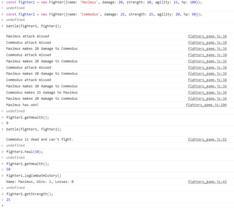

TASK  

**1) Create a Fighter:**  
You should create a function or class ‘Fighter’ which takes an object with fighter properties and returns interface with fighter methods:  

`const myFighter = new Fighter({name: ‘Maximus, damage: 25, hp: 100, strength: 30, agility: 25});` // returns an object with methods  

!!!Note that none of the Fighter’s properties may be available directly. The only way to get or change each property is to use one of Fighter’s methods!!!  
```
let name = myFighter.name;  
console.log(name); // undefined  
```


**Fighter methods:**  

**getName**. This function returns fighter’s name property.  
```
let name = myFighter.getName();  
console.log(name); // Maximus  
```


**getDamage**. This function returns fighter’s damage property.  
```
let damage = myFighter.getDamage();  
console.log(damage); // 20
```
  

**getStrength**. This function returns fighter’s strength property.  
	let strength = myFIghter.getStrength();  
	console.log(strength); // 30  

**getAgility**. This function returns fighter’s agility property.  
```
let agility = myFighter.getAgility();  
console.log(agility); // 25  
```


**getHealth**. This function returns fighter’s current HP property.  
```
let health = myFighter.getHealth();  
console.log(health); // 100 
```
 

**attack**. This function takes argument (instance of ‘Fighter’), which will be a defender. Then it randomly calculates if current attack is successful (probability of success is inversely proportional to defender’s strength + agility property). For example, if defender’s strength is 30 and agility is 20, success probability of current attack will be 50%. If defender’s strength is 15 and agility is 10, success probability of current attack will be 75% etc. If attack is successful, defenders’ current HP property is decreased by number of points equal to attacker’s damage property and message about successful attack is logged in console. Otherwise, message about missed attack is logged.  
```
myFighter.attack(myFighter2);  
// Maximus makes 20 damage to Commodus  
myFighter2.attack(myFighter);  
// Commodus attack missed 
```
 

**logCombatHistory**. This function logs to console information about fighter’s combat
history.  
`myFighter.logCombatHistory(); // Name: Maximus, Wins: 0, Losses: 0 ` 

**heal**. This function takes amount of health points and add this amount to fighter’s current
HP (if result is higher than fighter’s total HP, than it heals only to total HP).  

`myFighter.heal(50);`

**dealDamage**. This function takes amount of health points and reduces these amount from fighter’s current HP (if it results to a negative number, current HP should equal 0):  
`myFighter.dealDamage(20);`

**addWin**. This function increases fighter’s wins property by one.  
`myFighter.addWin();`

**addLoss**. This function increases fighter’s losses property by one.  
`myFighter.addLoss();`

**2) Create a ‘battle’ function:**  
This function takes 2 arguments (instances of ‘Fighter’)  and simulates battle between them. It performs attacks of each fighter on another until one of them is dead (current HP is 0). After that it logs the message with the name of the winner and increases winner’s ‘wins’ property and loser’s ‘losses’ property by one.
If at the start of battle one of given fighter’s is dead (his HP equal to 0), battle shouldn’t be simulated and warning message about it should be logged in console.

If there are 2 losers the function should return 0(There may be a case when Both of them attack at the same time
and their health scores then are equal to 0)
If there is 1 loser the function should return the loser
If one of the fighters is initially dead , the funtion shoud log '<fighter's name> is dead' and return 0


EXAMPLE 1

const fighter1=new Fighter({name: 'Maximus', damage: 25, hp: 105, strength: 30, agility: 40});
const fighter2 = new Fighter({name: 'David', damage: 15, hp: 0, strength: 10, agility: 10});

battle(fighter1,fighter2) // 'David is dead'


**Battle Example**  


